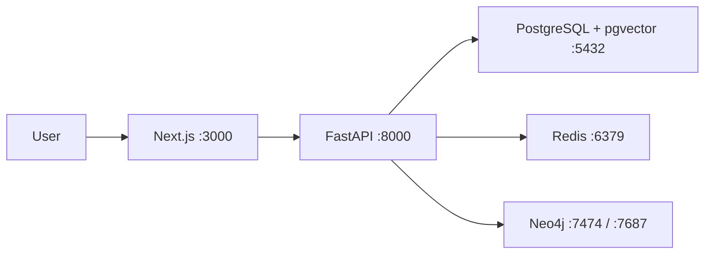

# Personal Knowledge Agent

A production-oriented personal knowledge management system that will combine
retrieval-augmented generation, agent workflows, and a visual knowledge graph.
The repository currently implements **Phase 0: Project Setup** only.

## What Phase 0 includes

- Next.js 16 frontend with strict TypeScript, Tailwind CSS, and shadcn/ui conventions
- FastAPI backend with typed environment settings, CORS, API docs, and health checks
- Docker images for both application services
- Docker Compose services for frontend, backend, PostgreSQL/pgvector, Redis, and Neo4j
- Automated backend lint/tests and frontend lint/type/build checks

Document ingestion, RAG, model calls, agents, and graph extraction are explicitly
reserved for later phases in [`PROJECT_SPEC.md`](PROJECT_SPEC.md).

## Architecture



See [`docs/architecture.md`](docs/architecture.md) for the Phase 0 boundaries.

## Quick start with Docker

Requirements: Docker Engine with Docker Compose v2.

```bash
cp .env.example .env
docker compose up --build
```

On PowerShell, copy the environment file with:

```powershell
Copy-Item .env.example .env
docker compose up --build
```

Then open:

- Frontend: <http://localhost:3000>
- API documentation: <http://localhost:8000/docs>
- Backend health: <http://localhost:8000/health>
- Neo4j Browser: <http://localhost:7474>

Change the example database and Neo4j passwords in `.env` before using any
shared or deployed environment.

## Run locally without Docker

### Backend

Python 3.12 is required.

```powershell
cd backend
python -m venv .venv
.\.venv\Scripts\Activate.ps1
python -m pip install -e ".[dev]"
uvicorn app.main:app --reload
```

For macOS/Linux, activate with `source .venv/bin/activate`.

### Frontend

Node.js 22+ and pnpm 11 are required.

```bash
cd frontend
pnpm install
pnpm dev
```

## Verification

Backend:

```powershell
cd backend
python -m ruff check --no-cache .
python -m pytest
```

Frontend:

```bash
cd frontend
pnpm lint
pnpm typecheck
pnpm build
```

Infrastructure:

```bash
docker compose config
docker compose up --build --wait
```

## Environment variables

All backend settings use the `APP_` prefix and are validated at startup. The
complete development template is in [`.env.example`](.env.example).

| Variable | Purpose |
| --- | --- |
| `APP_ENVIRONMENT` | Runtime environment name |
| `APP_DEBUG` | FastAPI debug mode |
| `APP_FRONTEND_URL` | Allowed browser origin |
| `APP_DATABASE_URL` | PostgreSQL SQLAlchemy connection URL |
| `APP_REDIS_URL` | Redis connection URL |
| `APP_NEO4J_URI` | Neo4j Bolt endpoint |
| `APP_NEO4J_USER` | Neo4j username |
| `APP_NEO4J_PASSWORD` | Neo4j password |
| `APP_OPENAI_API_KEY` | Reserved for later AI phases; unused in Phase 0 |
| `NEXT_PUBLIC_API_URL` | Browser-visible FastAPI base URL |

## Design decisions

- Application and infrastructure concerns remain in separate top-level folders.
- Settings are model-backed and environment-driven so model/database providers can
  be replaced later without scattering configuration through the codebase.
- Compose health checks gate dependent services and make startup failures visible.
- Dependency versions are constrained and the frontend lockfile is committed for
  reproducible installs.
- Phase 0 exposes no placeholder AI endpoints; future behavior will be added only
  when its roadmap phase begins.

Screenshots will be added with the first interactive product workflow in Phase 1.
