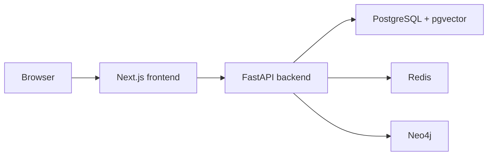

# Phase 0 architecture

The initial architecture separates the browser application, API, and stateful
services. Docker Compose supplies a repeatable local environment and waits for
each dependency to become healthy before starting its consumers.

No service integration or AI behavior is implemented in Phase 0. The API only
exposes system endpoints, and the data services are ready for later phases.

